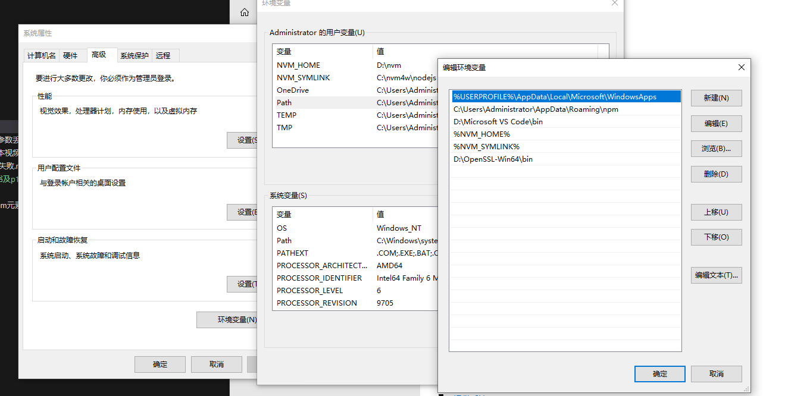
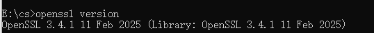
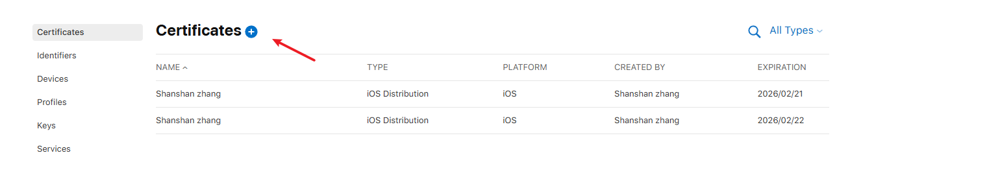
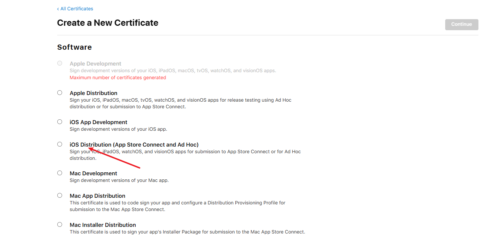
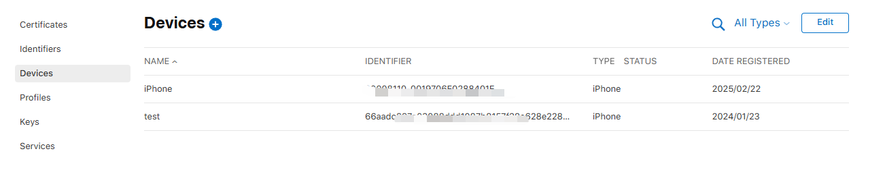
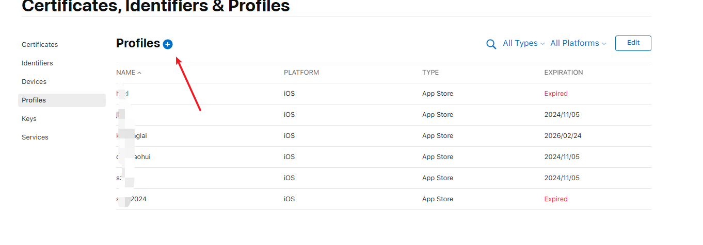
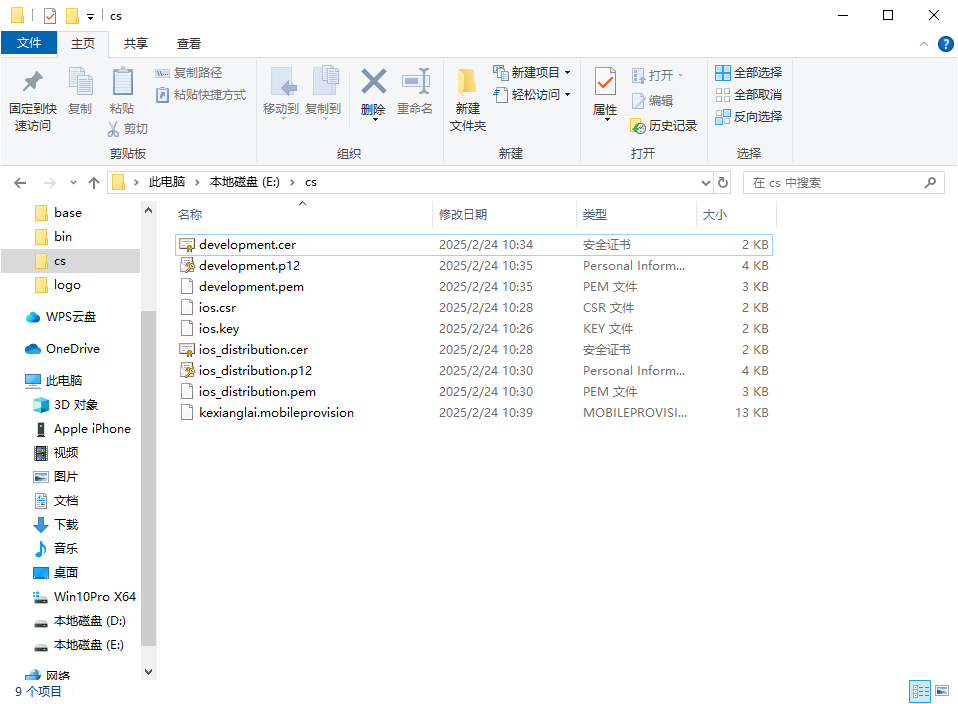

# OpenSSL 生成 iOS 证书及 p12 文件

### 1.安装 OpenSSL 工具(官网下载 OpenSSL`https://openssl-library.org/source/`)或(便捷打包安装包下载安装`https://slproweb.com/products/Win32OpenSSL.html`)

### 2.添加环境变量

```
1.找到系统环境变量Path

2.点击编辑,添加openssl 安装路径

3.确认保存
```



### 3.验证环境变量是否生效,输入`openssl version` 如果出现版本信息就说配置成功了



### 4.生成 csr 文件

```

1.通过openssl生成csr文件
openssl genrsa -out hjsc_ios.key 2048
openssl req -new -sha256 -key hjsc_ios.key -out hjsc_ios.csr

回车填写信息：

1.Country Name：

填您所在国家的ISO标准代号，如中国为CN，美国为US

2.State or Province Name：

填您单位所在地省/自治区/直辖市，如广东省或 Guangdong

3.Locality Name：

填您单位所在地的市/县/区，如佛山市或Foshan

4.Organization Name：

填您单位/机构/企业合法的名称，如某某科技股份有限公司或XXXXX XX XX Co., Ltd

5.Organizational Unit Name：

填部门名称，如技术支持部或Technical support

6.Common Name：

填域名。在多个域名时，填主域名，可为空，按回车跳过

7.Email Address：

填您的邮件地址，可为空，按回车跳过

8.'extra' attributes
密码需要填加，其他的如不想填写则，按回车跳过
```

### 5.生成 cer 文件



上传生成的 csr 文件，下载 cer 文件

### 6.生成 p12 文件

```
# 需要用到第一步生成的 ios.key 文件，以及 Apple 生成的 ios_distribution.cer 和 ios_development.cer 文件。
openssl x509 -in ios_distribution.cer -inform DER -outform PEM -out ios_distribution.pem
openssl pkcs12 -export -inkey ios.key -in ios_distribution.pem -out ios_distribution.p12

openssl x509 -in development.cer -inform DER -outform PEM -out development.pem
openssl pkcs12 -export -inkey ios.key -in development.pem -out development.p12
```

### 7.添加测试设备 id



### 8.生成描述文件




